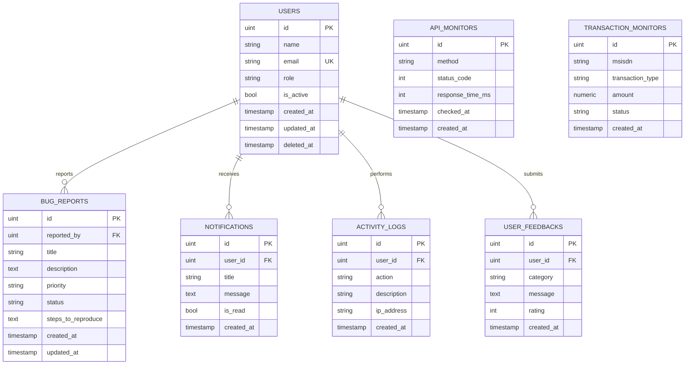

# Database Documentation

Dokumentasi ini menjelaskan struktur database yang digunakan oleh
**Digital Channel Monitoring System**.

Database menggunakan **PostgreSQL** dengan **GORM (Go ORM)** sebagai
lapisan akses database.

---

## 1. Database Overview

Sistem menggunakan tujuh tabel utama:

| No | Tabel | Fungsi |
|---|---|---|
| 1 | `users` | Menyimpan data pengguna sistem |
| 2 | `bug_reports` | Menyimpan laporan bug |
| 3 | `api_monitors` | Menyimpan data monitoring request API |
| 4 | `transaction_monitors` | Menyimpan data monitoring transaksi |
| 5 | `activity_logs` | Menyimpan histori aktivitas pengguna |
| 6 | `user_feedbacks` | Menyimpan feedback pengguna |
| 7 | `notifications` | Menyimpan notifikasi pengguna |

---

# 2. Entity Relationship Diagram (ERD)



> **Catatan implementasi:** `api_monitors` dan `transaction_monitors` tidak memiliki relasi langsung dengan `users` karena kedua tabel tersebut digunakan untuk mencatat kondisi sistem dan aktivitas transaksi secara umum.

---

# 3. Penjelasan Setiap Tabel

## 3.1 `users`

Tabel `users` menyimpan data pengguna internal sistem, yaitu pengguna dengan role `admin` atau `staff`.

| Kolom | Tipe | Constraint | Keterangan |
|---|---|---|---|
| `id` | uint | Primary Key | Identitas unik pengguna |
| `name` | string | NOT NULL | Nama lengkap pengguna |
| `email` | string | UNIQUE, NOT NULL | Digunakan untuk login |
| `role` | varchar(20) | NOT NULL, DEFAULT `staff` | Role pengguna (`admin` / `staff`) |
| `is_active` | bool | DEFAULT `true` | Menentukan apakah akun masih aktif |
| `created_at` | timestamp | - | Waktu pembuatan data |
| `updated_at` | timestamp | - | Waktu terakhir data diperbarui |
| `deleted_at` | timestamp | Nullable, Indexed | Digunakan untuk soft delete |

### Role

Sistem memiliki dua role:

- `admin`
- `staff`

Role digunakan untuk membatasi akses terhadap fitur tertentu menggunakan middleware authorization.

### Soft Delete

Tabel `users` menggunakan soft delete melalui `gorm.DeletedAt`.

Artinya, ketika user dihapus, data tidak langsung dihapus secara permanen dari database. Sistem hanya mengisi kolom `deleted_at`.

Pendekatan ini membantu mempertahankan histori data pengguna dan mengurangi risiko kehilangan data secara permanen.

---

## 3.2 `bug_reports`

Tabel `bug_reports` menyimpan laporan bug yang dibuat oleh pengguna sistem.

| Kolom | Tipe | Constraint | Keterangan |
|---|---|---|---|
| `id` | uint | Primary Key | ID unik bug report |
| `reported_by` | uint | NOT NULL, FK | ID user yang membuat laporan |
| `title` | string | NOT NULL | Judul bug |
| `description` | text | - | Penjelasan detail bug |
| `priority` | varchar(10) | NOT NULL | Prioritas bug (`P1` - `P4`) |
| `status` | varchar(20) | NOT NULL, DEFAULT `new` | Status lifecycle bug |
| `steps_to_reproduce` | text | - | Langkah untuk mereproduksi bug |
| `created_at` | timestamp | - | Waktu bug dibuat |
| `updated_at` | timestamp | - | Waktu terakhir bug diperbarui |

### Bug Status Lifecycle

Bug report mengikuti alur status:

```text
new
  ↓
assigned
  ↓
in_progress
  ↓
fixed
  ↓
retesting
  ├──→ verified
  │      ↓
  │    closed
  │
  └──→ reopened
          ↓
       assigned
```

Perubahan status dikontrol oleh business logic di service layer.

Contohnya, bug dengan status `new` tidak dapat langsung diubah menjadi `closed`.

### Priority

Prioritas bug terdiri dari:

- `P1`
- `P2`
- `P3`
- `P4`

Prioritas digunakan untuk menentukan tingkat urgensi penanganan bug.

### Catatan Severity

Pada source code model saat ini terdapat tipe `Severity` dan konstanta seperti:

```text
critical
high
medium
low
```

Namun, field `Severity` **belum menjadi kolom pada struct `BugReport`**.

Oleh karena itu, `severity` tidak dicatat sebagai kolom database pada dokumentasi struktur aktual saat ini.

Jika fitur severity ingin digunakan secara penuh, model dapat dikembangkan dengan menambahkan field:

```go
Severity Severity `json:"severity" gorm:"type:varchar(20);not null"`
```

---

## 3.3 `api_monitors`

Tabel `api_monitors` digunakan untuk menyimpan hasil monitoring request API.

Data monitoring dibuat secara otomatis melalui middleware monitoring.

| Kolom | Tipe | Constraint | Keterangan |
|---|---|---|---|
| `id` | uint | Primary Key | ID unik log monitoring |
| `method` | varchar(10) | NOT NULL | HTTP method seperti GET, POST, PATCH, DELETE |
| `status_code` | int | NOT NULL | HTTP response status code |
| `response_time_ms` | int | NOT NULL | Waktu response dalam milidetik |
| `checked_at` | timestamp | NOT NULL, Indexed | Waktu request diproses |
| `created_at` | timestamp | - | Waktu data dibuat |

### Monitoring Response Time

`response_time_ms` digunakan untuk mengukur performa API.

Contoh:

```text
response_time_ms = 25
```

Artinya request membutuhkan sekitar 25 milidetik untuk diproses.

Data ini dapat digunakan untuk menghitung:

- Average Response Time
- Performance Trend
- Endpoint Performance
- Potensi API yang lambat

### Monitoring Status Code

`status_code` digunakan untuk mengidentifikasi hasil request.

Contoh:

```text
200 → Success
201 → Created
400 → Bad Request
401 → Unauthorized
404 → Not Found
422 → Validation Error
500 → Internal Server Error
```

Monitoring statistik error pada aplikasi menggunakan response dengan status code `500` ke atas sebagai indikasi server error.

### Index

Kolom `checked_at` diberi index karena sering digunakan untuk query berdasarkan rentang waktu.

Contohnya:

```text
Monitoring API 24 jam terakhir
Monitoring API 7 hari terakhir
```

Seiring pertumbuhan jumlah request, index membantu query berbasis waktu menjadi lebih efisien.

---

## 3.4 `transaction_monitors`

Tabel `transaction_monitors` digunakan untuk mencatat status transaksi bisnis.

| Kolom | Tipe | Constraint | Keterangan |
|---|---|---|---|
| `id` | uint | Primary Key | ID internal transaksi |
| `msisdn` | string | NOT NULL, Indexed | Nomor pelanggan |
| `transaction_type` | string | NOT NULL | Jenis transaksi |
| `amount` | numeric | NOT NULL | Nominal transaksi |
| `status` | varchar(20) | NOT NULL, Indexed | Status transaksi |
| `created_at` | timestamp | - | Waktu transaksi dicatat |

### Transaction Status

Status transaksi yang digunakan:

```text
success
failed
pending
```

### MSISDN

Kolom `msisdn` menyimpan nomor pelanggan yang terkait dengan transaksi.

Kolom ini diberi index karena dapat digunakan untuk pencarian transaksi berdasarkan nomor pelanggan.

Contoh:

```text
GET /monitoring/transactions?msisdn=081234567890
```

### Amount

Kolom `amount` menggunakan tipe PostgreSQL `numeric`.

Pada implementasi Go, field ini direpresentasikan menggunakan `float64`.

Untuk sistem finansial production dengan kebutuhan presisi tinggi, implementasi selanjutnya dapat menggunakan representasi integer dalam satuan terkecil atau tipe decimal khusus untuk menghindari potensi masalah floating-point.

### Transaction ID

Pada implementasi saat ini, tabel menggunakan `id` sebagai primary key internal.

UUID digunakan pada proses pembuatan transaction ID di handler aplikasi, tetapi **belum disimpan sebagai kolom `transaction_id` pada model `TransactionMonitor`**.

Ini merupakan area yang dapat dikembangkan pada versi berikutnya jika transaction ID perlu digunakan sebagai identifier eksternal.

---

## 3.5 `activity_logs`

Tabel `activity_logs` digunakan sebagai audit trail untuk mencatat aktivitas penting pengguna.

| Kolom | Tipe | Constraint | Keterangan |
|---|---|---|---|
| `id` | uint | Primary Key | ID log |
| `user_id` | uint | Relasi User | ID pengguna yang melakukan aktivitas |
| `action` | string | NOT NULL | Jenis aktivitas |
| `description` | string | - | Penjelasan aktivitas |
| `ip_address` | string | - | IP address pengguna |
| `created_at` | timestamp | - | Waktu aktivitas |

### Action

Saat ini aktivitas yang dicatat meliputi:

```text
CREATE_BUG
UPDATE_BUG
DELETE_BUG
```

Contoh:

```text
action:
CREATE_BUG

description:
Membuat bug report: Login gagal
```

Pemisahan antara `action` dan `description` memungkinkan sistem melakukan filtering berdasarkan jenis aktivitas sekaligus tetap menyediakan informasi detail untuk dibaca manusia.

### Catatan Relasi User

Model `ActivityLog` saat ini memiliki field:

```go
User User `gorm:"foreignKey:UserID"`
```

Namun field `UserID` belum didefinisikan secara eksplisit pada struct.

Untuk relasi database yang lebih eksplisit dan konsisten, model dapat dikembangkan menjadi:

```go
UserID uint `json:"user_id" gorm:"not null"`
User   User `json:"user" gorm:"foreignKey:UserID"`
```

Dengan begitu, foreign key `user_id` dapat didefinisikan secara jelas pada database.

---

## 3.6 `user_feedbacks`

Tabel `user_feedbacks` menyimpan feedback yang diberikan oleh pengguna.

| Kolom | Tipe | Constraint | Keterangan |
|---|---|---|---|
| `id` | uint | Primary Key | ID feedback |
| `user_id` | uint | Relasi User | ID pengguna |
| `category` | string | NOT NULL | Kategori feedback |
| `message` | text | NOT NULL | Isi feedback |
| `rating` | int | CHECK 1-5 | Nilai rating |
| `created_at` | timestamp | - | Waktu feedback dibuat |

### Rating

Rating dibatasi pada rentang:

```text
1 - 5
```

Database menggunakan CHECK constraint:

```sql
rating >= 1 AND rating <= 5
```

Validasi di level database merupakan bentuk **defense in depth**.

Artinya, walaupun validasi aplikasi mengalami masalah, database tetap dapat mencegah nilai rating di luar rentang yang diperbolehkan.

### Catatan Relasi User

Sama seperti `ActivityLog`, model `UserFeedback` memiliki relasi:

```go
User User `gorm:"foreignKey:UserID"`
```

tetapi belum memiliki field `UserID` eksplisit pada struct.

Untuk implementasi yang lebih konsisten, field berikut dapat ditambahkan:

```go
UserID uint `json:"user_id" gorm:"not null"`
```

---

## 3.7 `notifications`

Tabel `notifications` digunakan untuk menyimpan notifikasi personal pengguna.

| Kolom | Tipe | Constraint | Keterangan |
|---|---|---|---|
| `id` | uint | Primary Key | ID notifikasi |
| `user_id` | uint | NOT NULL, FK | User penerima |
| `title` | string | NOT NULL | Judul notifikasi |
| `message` | text | - | Isi notifikasi |
| `is_read` | bool | DEFAULT `false` | Status sudah dibaca atau belum |
| `created_at` | timestamp | - | Waktu notifikasi dibuat |

### Notification Status

Kolom `is_read` digunakan untuk membedakan notifikasi:

```text
false → Belum dibaca
true  → Sudah dibaca
```

Default value adalah:

```text
false
```

Sehingga setiap notifikasi baru secara otomatis dianggap belum dibaca.

---

# 4. Relasi Antar Tabel

## Users → Bug Reports

Satu user dapat membuat banyak bug report.

```text
1 User
   │
   ├── Bug Report 1
   ├── Bug Report 2
   └── Bug Report 3
```

Relasi:

```text
users.id
    ↓
bug_reports.reported_by
```

---

## Users → Notifications

Satu user dapat menerima banyak notifikasi.

```text
1 User
   │
   ├── Notification 1
   ├── Notification 2
   └── Notification 3
```

Relasi:

```text
users.id
    ↓
notifications.user_id
```

---

## Users → Activity Logs

Secara konsep, satu user dapat memiliki banyak activity log.

```text
1 User
   │
   ├── CREATE_BUG
   ├── UPDATE_BUG
   └── DELETE_BUG
```

Activity log digunakan sebagai audit trail aktivitas pengguna.

---

## Users → User Feedbacks

Secara konsep, satu user dapat mengirim banyak feedback.

```text
1 User
   │
   ├── Feedback 1
   ├── Feedback 2
   └── Feedback 3
```

---

## API Monitors

`api_monitors` berdiri sebagai tabel monitoring sistem.

Tidak memiliki relasi langsung dengan `users`.

Data dibuat oleh middleware secara otomatis ketika request API diproses.

---

## Transaction Monitors

`transaction_monitors` juga berdiri sebagai tabel monitoring transaksi.

Tidak memiliki relasi langsung dengan `users`.

Data mencatat transaksi berdasarkan MSISDN dan jenis transaksi.

---

# 5. Indexing Strategy

Index digunakan secara selektif pada kolom yang sering digunakan untuk pencarian atau filtering.

### `users.deleted_at`

Digunakan oleh GORM untuk mendukung mekanisme soft delete.

### `api_monitors.checked_at`

Digunakan untuk mempercepat query monitoring berdasarkan waktu.

Contoh:

```text
Monitoring 24 jam terakhir
Monitoring 7 hari terakhir
```

### `transaction_monitors.msisdn`

Digunakan untuk mempercepat pencarian transaksi berdasarkan nomor pelanggan.

### `transaction_monitors.status`

Digunakan untuk filtering transaksi berdasarkan status:

```text
success
failed
pending
```

---

# 6. Design Decisions

## 6.1 PostgreSQL sebagai Database

PostgreSQL digunakan karena menyediakan:

- Relational database yang kuat
- Dukungan transaksi
- Constraint database
- Indexing
- Tipe data `numeric`
- Cocok untuk aplikasi backend Go

---

## 6.2 GORM sebagai ORM

GORM digunakan untuk menghubungkan aplikasi Go dengan PostgreSQL.

Keuntungan:

- Mengurangi boilerplate SQL
- Mendukung model-based database access
- Mendukung migration
- Mempermudah query database
- Integrasi dengan struct Go

---

## 6.3 Soft Delete pada Users

Soft delete digunakan pada tabel `users` agar data pengguna tidak langsung hilang secara permanen.

Hal ini berguna untuk mempertahankan histori data dan aktivitas sistem.

---

## 6.4 Pemisahan API Monitoring dan Transaction Monitoring

Monitoring API dan monitoring transaksi dipisahkan menjadi dua tabel karena memiliki tujuan berbeda.

`api_monitors` berfokus pada:

- Response time
- HTTP status code
- Waktu request

Sedangkan `transaction_monitors` berfokus pada:

- MSISDN
- Jenis transaksi
- Nominal transaksi
- Status transaksi

Pemisahan ini membuat struktur database lebih terorganisir dan memudahkan pengembangan fitur monitoring.

---

## 6.5 Pemisahan Activity Log dan API Monitor

Activity log dan API monitor juga memiliki tujuan berbeda.

### API Monitor

Mencatat aktivitas teknis sistem:

```text
HTTP Request
Response Time
HTTP Status Code
```

### Activity Log

Mencatat aktivitas bisnis atau pengguna:

```text
CREATE_BUG
UPDATE_BUG
DELETE_BUG
```

Dengan pemisahan tersebut, sistem dapat membedakan antara:

```text
"Apakah API sedang bermasalah?"
```

dan:

```text
"Siapa yang melakukan perubahan data?"
```

---

## 6.6 Validasi di Application Layer dan Database Layer

Sistem menerapkan validasi pada dua level.

### Application Layer

Validasi dilakukan melalui Go dan validator.

Contoh:

```text
Email wajib valid
Password wajib memenuhi aturan
Amount harus lebih dari 0
Status harus sesuai aturan
```

### Database Layer

Database juga memiliki constraint tertentu.

Contoh:

```text
PRIMARY KEY
UNIQUE
NOT NULL
CHECK
INDEX
```

Pendekatan ini memberikan pertahanan berlapis terhadap data yang tidak valid.

---

# 7. Data Integrity

Database menggunakan beberapa mekanisme untuk menjaga integritas data:

- Primary Key untuk identitas unik setiap record
- Unique constraint pada email user
- Not Null untuk field wajib
- Check constraint untuk rating feedback
- Foreign key relationship pada entity yang memiliki relasi user
- Index untuk meningkatkan efisiensi query

---

# 8. Future Improvements

Beberapa pengembangan yang dapat dilakukan pada versi berikutnya:

### 1. Menambahkan `Severity` ke Bug Report

Model saat ini sudah memiliki definisi `Severity`, tetapi belum menyimpan field tersebut di database.

Pengembangan berikutnya dapat menambahkan:

```go
Severity Severity `json:"severity" gorm:"type:varchar(20);not null"`
```

---

### 2. Menambahkan `UserID` Eksplisit pada Activity Log

Saat ini relasi User pada `ActivityLog` belum memiliki field `UserID` eksplisit.

Disarankan menggunakan:

```go
UserID uint `json:"user_id" gorm:"not null"`
User   User `json:"user" gorm:"foreignKey:UserID"`
```

---

### 3. Menambahkan `UserID` Eksplisit pada User Feedback

Hal yang sama dapat diterapkan pada `UserFeedback`:

```go
UserID uint `json:"user_id" gorm:"not null"`
User   User `json:"user" gorm:"foreignKey:UserID"`
```

---

### 4. Menyimpan Transaction ID sebagai UUID

Saat ini UUID dibuat pada proses aplikasi, tetapi model database belum memiliki kolom `transaction_id`.

Untuk sistem yang lebih realistis, dapat ditambahkan:

```go
TransactionID string `json:"transaction_id" gorm:"unique;not null"`
```

UUID dapat digunakan sebagai identifier transaksi yang aman untuk kebutuhan eksternal.

---

### 5. API Monitor Retention Policy

Tabel `api_monitors` dapat bertambah sangat cepat karena setiap request dicatat.

Production system dapat menerapkan:

- Retention policy
- Data archiving
- Scheduled cleanup
- Partitioning berdasarkan tanggal

Contoh:

```text
Simpan data monitoring 90 hari
        ↓
Data > 90 hari
        ↓
Archive / Delete
```

---

### 6. Optimasi Representasi Nominal

`amount` saat ini menggunakan PostgreSQL `numeric` dan direpresentasikan sebagai `float64` di Go.

Untuk sistem finansial production, dapat dipertimbangkan penggunaan:

- Integer dalam satuan terkecil
- Decimal library
- Representasi uang khusus

Tujuannya adalah menghindari potensi masalah presisi floating-point.

---

# 9. Summary

Database Digital Channel Monitoring System terdiri dari tujuh tabel utama:

```text
users
├── bug_reports
├── notifications
├── activity_logs
└── user_feedbacks

api_monitors

transaction_monitors
```

Database dirancang untuk mendukung tiga kebutuhan utama:

1. **Application Data**
   - Users
   - Bug Reports
   - User Feedback

2. **System Monitoring**
   - API Monitoring
   - Transaction Monitoring

3. **Audit & User Engagement**
   - Activity Logs
   - Notifications

Struktur database menggunakan PostgreSQL dengan GORM dan menerapkan konsep relational database, indexing, validation, soft delete, monitoring, dan audit logging.